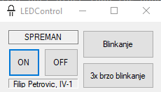

# LEDControl

## Summary
It can be used to control LED using Arduino (onboard or external), supporting only Arduino Uno R3 for now (though you can change a variable in code & use other Arduinos that ArduinoDriver supports).

This WinForms app uses ArduinoDriver nuget package that automatically finds the Arduino specified, deploys the app and is able to directly interface with the board.

So far, it supports these patterns:
* Constant ON
* Constant blinking (delay parameter affects this)
* 3x rapid blinking

Planned features are:
* Ability to select more Arduino models (that ArduinoDriver supports)
* Ability to select a custom LED port so you can hook up an LED on another digital port other than the onboard LED

## Main panel

